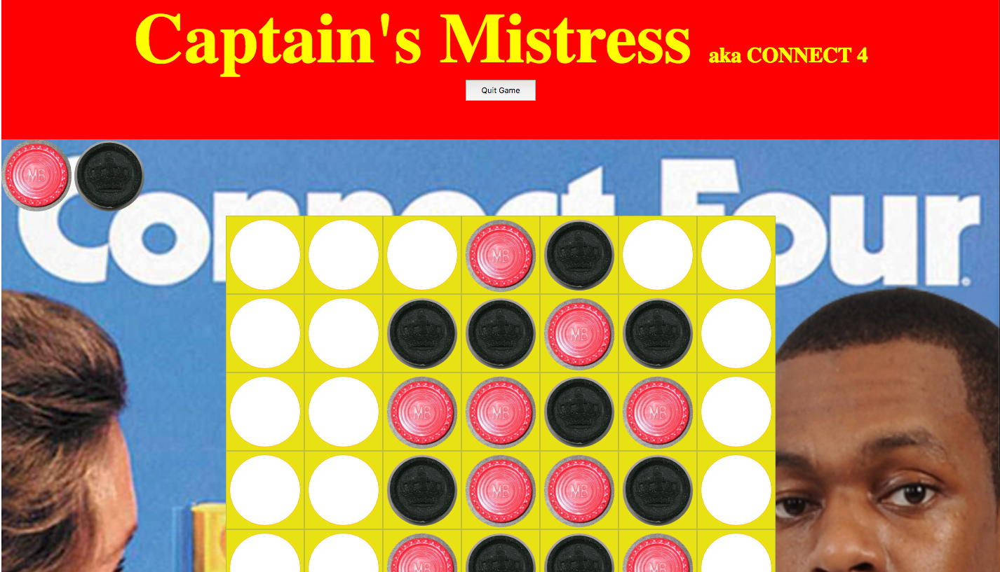

# Connect 4

###Summary
Captain's Mistress is a 2 player game where each player takes turns choosing an empty space to place their color piece in an attempt to get 4 pieces in a row while stopping the other player from doing the same. You may know this game by its common American name of "Connect Four".

#####How to play:
Player one chooses a color and player 2 automatically gets the 2nd color. They both take turns selecting columns to drop their piece to the bottom most empty space and work their way up while trying to get four of their own piece in a row vertically, horizontally or diagonally, to win the game, at the same time preventing the other player from doing the same. First player to get 4 in a row wins. If no player gets 4 in a row then the game is a draw.

Play Captain's Mistress here:

---

###Development & Technologies

Captain's Mistress is being built using HTML, CSS, JavaScript, jQuery & the jQuery UI library

---

User Stories

* Upon arriving to the website the game scene is set, you only have the option to click the start game button to be able to play
* Once start game is clicked player 1 is prompted to pick a color
* Game is now live, player 1 chooses where they would like to go first, after placing their piece it is the 2nd players turn
* If there is a winner the winning color will be displayed across the screen
* Users will be prompted if they would like to play again or not

---

###Unsolved Problems

* I wanted to make pieces draggable and droppable
* I wanted to create more animation upon winning
* I wanted to make game auto adjust size when screen gets smaller

---

###Credits

"Rajon Rondo" for being a wonderful game model!
